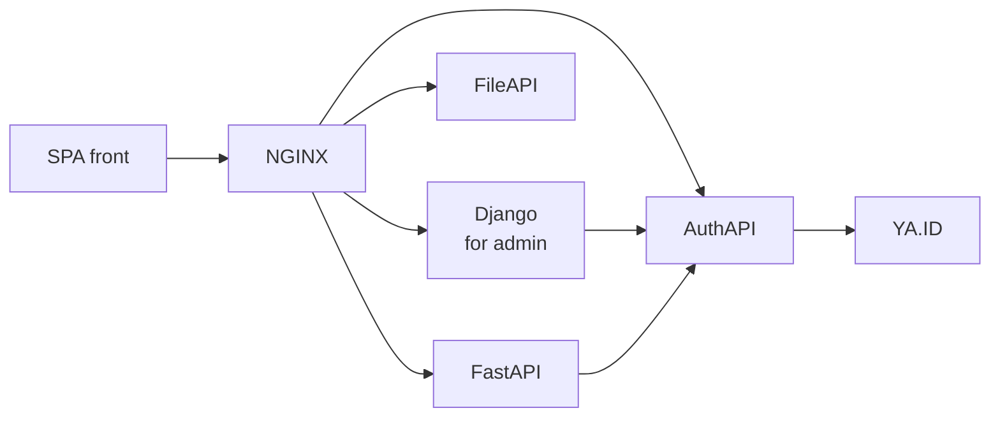
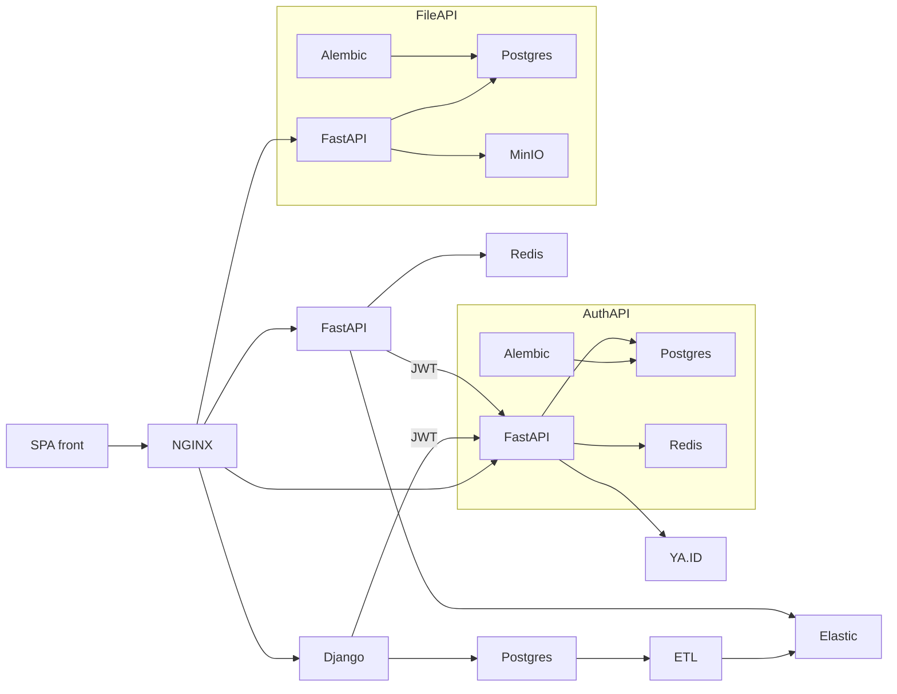

# HLD

```mermaid
flowchart LR;
    Django["Django
    for admin"]
    SPA["SPA front"]
    SPA-->NGINX;
    NGINX-->AuthAPI;
    NGINX-->FileAPI;
    NGINX-->Django;
    NGINX-->FastAPI;
    Django-->AuthAPI;
    FastAPI-->AuthAPI;
    AuthAPI-->YA.ID;
```

# LLD

```mermaid
flowchart LR;
    Django["Django"]
    FastAPI-A["FastAPI"]
    FastAPI-F["FastAPI"]
    Alembic-A["Alembic"]
    Alembic-F["Alembic"]
    Postgres-A["Postgres"]
    Postgres-F["Postgres"]
    Postgres-M["Postgres"]
    UserAPI["FastAPI"]
    Redis-U["Redis"]
    SPA["SPA front"]
    SPA-->NGINX;
    NGINX-->FastAPI-A;
    NGINX-->FastAPI-F;
    NGINX-->Django;
    NGINX-->UserAPI;
    Django--JWT-->FastAPI-A;
    Django-->Postgres-M;
    Postgres-M-->ETL;
    ETL-->Elastic;
    UserAPI-->Elastic;
    UserAPI-->Redis-U;
    UserAPI--JWT-->FastAPI-A;
    FastAPI-A-->YA.ID;
    subgraph AuthAPI;
    Alembic-A-->Postgres-A;
    FastAPI-A-->Postgres-A;
    FastAPI-A-->Redis;
    end
    subgraph FileAPI;
    FastAPI-F-->MinIO;
    FastAPI-F-->Postgres-F;
    Alembic-F-->Postgres-F;
    end
```